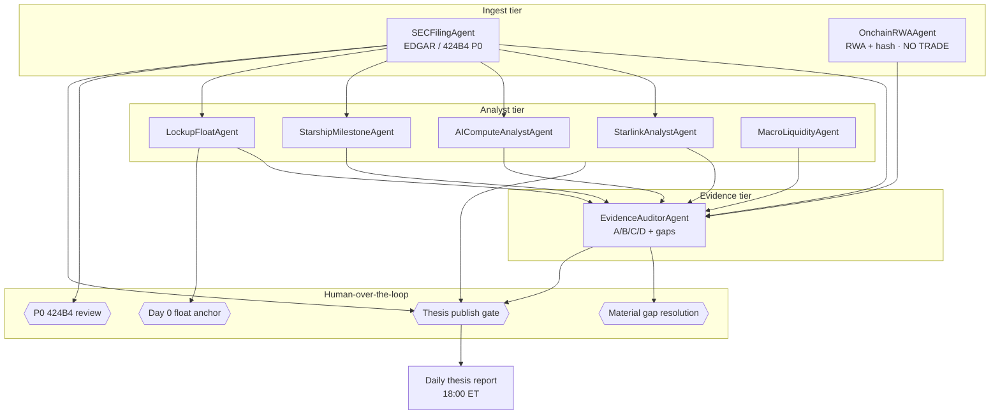

# SPACX agent orchestration

Eight intelligence agents under `plugin/agents/`. Scheduler: [`plugin/scheduler.yaml`](../plugin/scheduler.yaml). Compliance: [`COMPLIANCE.md`](COMPLIANCE.md). Phase 1 evidence baseline: [integrated audit opinion](../workstreams/sec-evidence-phase1/audit/00-integrated-audit-opinion.md).

## Agent roster

| Agent | Primary function | Scheduler tier |
|-------|------------------|----------------|
| **SECFilingAgent** | EDGAR monitor; 424B4 P0 | 1h SEC (+ 15m when watch active) |
| **EvidenceAuditorAgent** | A/B/C/D grading; gap register | 6h + daily thesis gate |
| **StarlinkAnalystAgent** | Connectivity KPIs | 15m market |
| **AIComputeAnalystAgent** | AI segment / Anthropic | 15m market |
| **StarshipMilestoneAgent** | Space / Starship milestones | 4h |
| **LockupFloatAgent** | Float path model | Daily 07:00 ET |
| **MacroLiquidityAgent** | Macro liquidity context | 15m market |
| **OnchainRWAAgent** | RWA + evidence hash (**no trading**) | 1–5m crypto |

## Orchestration diagram

## Data flow (simplified)

1. **SECFilingAgent** ingests EDGAR → emits `filing.detected` / `filing.p0_424b4`.
2. **EvidenceAuditorAgent** grades all downstream claims; blocks thesis if material gaps open.
3. Segment agents (**Starlink**, **AICompute**, **Starship**) consume SEC artifacts + master tables.
4. **LockupFloatAgent** models supply path; **Day 0** requires human confirmation after 424B4.
5. **MacroLiquidityAgent** adds non-SEC context (labeled C/D only).
6. **OnchainRWAAgent** hashes artifacts and watches RWA — never touches execution layer.

## Human-over-the-loop gates

| Gate ID | Owner trigger | Blocks until human OK |
|---------|---------------|------------------------|
| `p0_424b4_review` | SECFilingAgent P0 | Phase 2 table refresh, final offering column |
| `material_gap_resolution` | EvidenceAuditorAgent | Bull/Base/Bear thesis update |
| `day0_anchor_confirmation` | LockupFloatAgent | Production tradable-float chart |
| `thesis_publish` | Daily scheduler 18:00 ET | External distribution of daily report |
| `A_grade_promotion` | EvidenceAuditorAgent | Any claim promoted to grade A |
| `hash_mismatch_investigation` | OnchainRWAAgent | Artifact restore from manifest |

Automation may **draft** reports and alerts; it may **not** bypass gates for external channels (compliance level ≥ 2).

## Phase 1 linkage

Phase 1 concluded **Pass with Exceptions** — 424B4 and listing date remain **Unverified** (B-007, B-008). Agents must treat `$135` and share count as scenario baseline until P0 review completes. See [00-integrated-audit-opinion.md](../workstreams/sec-evidence-phase1/audit/00-integrated-audit-opinion.md) §中文执行摘要.

## 中文摘要

- 八代理分工：SEC 监控 → 证据分级 → 三分部研究 + 锁定期供给 + 宏观 + 链上哈希（**不交易**）。
- 人工门控：424B4 P0、重大缺口、定价日锚定、日报发布。
- 调度：加密 1–5 分钟、市场 15 分钟、SEC 1 小时、日报 18:00 ET。
