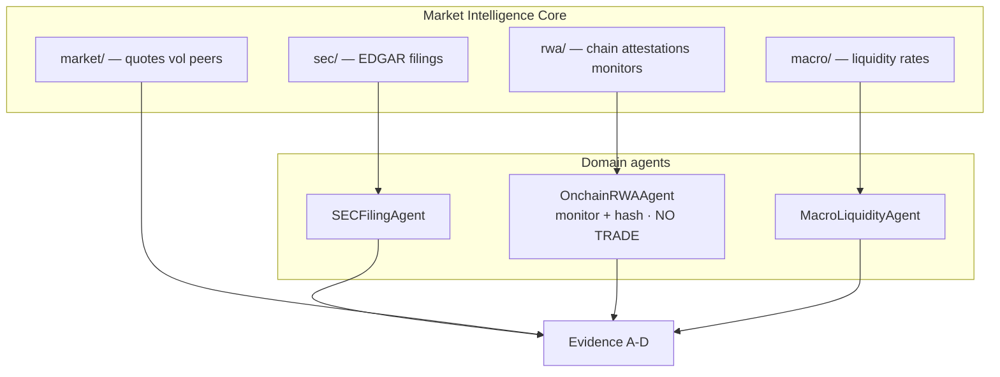
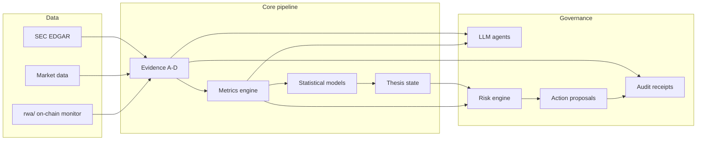

# SPACX Intelligence — Architecture

**Product:** SPACX autonomous market intelligence plugin · **Asset (proposed symbol):** SPCX · **V0:** research + alerts + proposals (compliance level 2)

---

## English

### Design thesis

AI-era investing treats markets as a **continuous event stream**, not a five-day report cycle. SPACX maintains a 24/7 **world model** (metrics, thesis probabilities, risk budget) and only emits **action candidates** when evidence grade, statistical gates, and compliance level align. Execution is deliberately后置 (postponed).

> **LLM is the researcher; statistics are the auditor; risk is the constitution; evidence is the chain of custody.**

### Layer stack

```text
Data → Evidence → Metrics → Statistical → LLM → Risk → Action → Audit
```

| Layer | Responsibility | AI may | AI must not |
|-------|----------------|--------|-------------|
| **Data** | SEC EDGAR, exchange, market, on-chain, RWA attestations | Ingest, dedupe, timestamp | Invent unsourced numbers |
| **Evidence** | Grade A/B/C/D, extract claims, hash packets | Map filing → claims | Promote social posts to core financials |
| **Valuation** | SOTP, anchors, implied multiples, reverse DCF | Frame C-tier external models | Override SEC A-tier numbers |
| **Metrics** | Formulas, baselines, thresholds (registry) | Compute ARPU, capex/revenue, float | Change formulas ad hoc |
| **Statistical** | Event study, Bayesian thesis, regime, factors, anomalies | Update P(thesis), flag AMBER/RED | Place orders |
| **LLM** | Explain deltas, write reports, hypothesize | Summarize conflicts | Override hard metrics or risk veto |
| **Risk** | Position caps, thematic exposure, blockers | HOLD / shrink proposals | Be bypassed by domain agents |
| **Action** | `ActionProposal` (observe, paper, size) | Propose | Auto-execute at level ≤2 |
| **Audit** | Receipts, evidence seals, optional on-chain hash | Log every state change | Mutate thesis without sealed evidence |

### Market Intelligence Core (data lanes)

The **Market Intelligence Core** ingests parallel **data lanes** into one evidence pipeline. SEC remains authoritative for SPCX financial claims; the **`rwa/`** lane is supplementary and pre-layer only.



| Lane | Path (logical) | Owner agent | Pre-layer scope |
|------|----------------|-------------|-----------------|
| **sec/** | Form S-1/A, FWP, 10-K/Q, 424B4 | SECFilingAgent, EvidenceAuditorAgent | Grade A/B primary; FWP review-only until cross-checked |
| **market/** | Post-listing + peer prices, vol (pre-listing: stub only) | *(metrics ingest)* | Surfaces after first trade confirmation |
| **rwa/** | Stablecoin peg, tokenized treasury attestations, collateral metadata | **OnchainRWAAgent** | W1 monitor + hash only |
| **macro/** | Rates, liquidity, funding | MacroLiquidityAgent | Thesis context |

**OnchainRWAAgent scope (预埋):** ingest indexed RWA/chain events, publish `evidence.content_hash_manifest`, emit `onchain.rwa_anomaly` — **forbidden:** wallet connect, sign, swaps, bridges, custody, staking, or any order routing. See [RWA_WEB3_STRATEGY.md](./RWA_WEB3_STRATEGY.md).

### Data flow



### 24/7 scheduler tiers

Hybrid **event-driven + cron** (see `plugin/scheduler.yaml` when present):

| Tier | Cadence | Targets |
|------|---------|---------|
| T0 | 1–5 min | Crypto, stablecoin, RWA liquidity, oracle deviation |
| T1 | 15 min | Futures, peers, vol, pre/after-hours |
| T2 | 1 hour | SEC EDGAR, exchange notices, tier-1 news |
| T3 | Daily | Thesis report, portfolio risk, watchlist |
| T4 | Weekly | Model scoring (Brier), threshold calibration |
| T* | Event | 424B4, earnings, lock-up, Starship, Nasdaq-100, RWA stress |

Market close ≠ system idle: filings, macro, and chain state still update the world model.

### Compliance levels (0–6)

| Level | Capability |
|-------|------------|
| **0** | Read-only research plugin |
| **1** | Automated reports and alerts |
| **2** | **Current V0** — trade *candidates*, no orders |
| **3** | Paper portfolio |
| **4** | Small live size, whitelist, human approval |
| **5** | Policy-bound auto-execution + kill switch |
| **6** | External advisory / fund management (legal/licensing) |

Robo-adviser and algorithmic trading supervision apply if level ≥4–6; this repo stays at **0–2** until explicitly gated.

### Web3 / RWA pre-layer (预埋)

Aligned with [RWA_WEB3_STRATEGY.md](./RWA_WEB3_STRATEGY.md) and Workstream 3 in [ROADMAP.md](./ROADMAP.md):

| Phase | Capability |
|-------|------------|
| **W1 (now)** | `rwa/` data lane + evidence hash + chain state monitor (stablecoin, tokenized treasury) |
| **W2** | RWA risk scoring (beyond TVL) |
| **W3** | Settlement abstraction (observe rails; no execution) |
| **W4** | Policy-bound wallet — gated, manual approval only |

**Not now:** main trading layer, auto on-chain execution. Tokenized ownership ≠ tradable liquid market (agent constitutional rule).

### Repository map

| Path | Role |
|------|------|
| `plugin/manifest.yaml` | Plugin contract |
| `plugin/schemas/` | JSON Schema SSOT |
| `plugin/api/` | Agent-callable stubs |
| `plugin/metrics/` | Registry + threshold engine |
| `plugin/models/` | Statistical interfaces |
| `plugin/agents/` | Nine agent roles (incl. ValuationAnalystAgent) |
| `plugin/valuation/` | SOTP, price anchors, implied multiples, reverse DCF |
| `workstreams/valuation-research/` | External model index + valuation audit |
| `workstreams/sec-evidence-phase1/` | Phase 1 SEC evidence (complete) |

---

## 中文

### 设计命题

AI 时代投资研究的对象是**连续事件流**，而不是「等财报 → 写报告 → 工作日复盘」。SPACX 7×24 维护**世界模型**（指标、thesis 概率、风险预算），仅在证据等级、统计门禁与合规级别同时满足时输出**行动建议**；交易执行故意后置。

> **大模型做研究员；统计做审计员；风控做宪法；证据做监管链。**

### 分层架构

```text
数据 → 证据 → 指标 → 统计 → 大模型 → 风控 → 行动 → 审计
```

| 层 | 职责 | 允许 | 禁止 |
|----|------|------|------|
| **数据** | SEC、行情、链上、RWA | 采集、去重、打时间戳 | 无来源数字入库 |
| **证据** | A/B/C/D 分级、抽取 claim、哈希封存 | 申报文件→结构化主张 | 社媒数字进核心财务表 |
| **估值** | SOTP、锚点、隐含倍数、反向 DCF | 标注 C 级外部模型 | 覆盖 SEC A 级数字 |
| **指标** | 公式、基线、阈值 | 计算 ARPU、capex/revenue | 随意改公式 |
| **统计** | 事件研究、贝叶斯 thesis、 regime | 更新 P(thesis) | 下单 |
| **大模型** | 解释、报告、假设 | 总结冲突 | 覆盖硬指标或风控否决 |
| **风控** | 仓位上限、主题暴露、阻塞项 | HOLD / 缩小建议 | 被业务 agent 绕过 |
| **行动** | `ActionProposal` | 提议 | V0 自动成交 |
| **审计** | 收据、证据 seal、可选上链哈希 | 全链路留痕 | 无证据改 thesis |

### 7×24 调度层级

| 层级 | 频率 | 对象 |
|------|------|------|
| T0 | 1–5 分钟 | 加密、稳定币、RWA 流动性 |
| T1 | 15 分钟 | 期货、同业、波动率 |
| T2 | 1 小时 | SEC、交易所公告、高质量新闻 |
| T3 | 每日 | Thesis 报告、组合风险 |
| T4 | 每周 | 模型评分、阈值校准 |
| T* | 事件触发 | 424B4、财报、解禁、Starship |

### 合规分级（0–6）

当前仓库 **V0 = Level 2**：可生成交易**候选**，不可自动下单。对外资管或全自动执行需 Level 6 法律结构，不在本阶段范围。

### Web3 / RWA 预埋

**市场情报核心**分数据通道：`sec/`（申报优先）、`market/`、`rwa/`（链上监控+哈希，非交易）、`macro/`。`OnchainRWAAgent` 仅负责 W1 监控与证据封存，禁止钱包与下单。

阶段 W1–W4 见 [RWA_WEB3_STRATEGY.md](./RWA_WEB3_STRATEGY.md) 与 [ROADMAP.md](./ROADMAP.md)。**代币化所有权 ≠ 流动性市场**（智能体宪法第一条）。

---

## Related docs

- [RWA_WEB3_STRATEGY.md](./RWA_WEB3_STRATEGY.md)
- [ROADMAP.md](./ROADMAP.md)
- [plugin/README.md](../plugin/README.md)
- Phase 1 synthesis: [workstreams/sec-evidence-phase1/audit/00-integrated-audit-opinion.md](../workstreams/sec-evidence-phase1/audit/00-integrated-audit-opinion.md)
