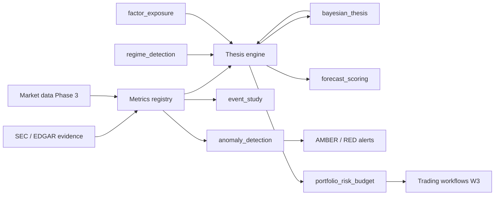

# SPACX models — integration architecture

**Platform:** SPACX · **Equity:** SPCX · **Package:** `plugin/models/`

This document describes how the V0 statistical engine connects to the planned **metrics registry** and **thesis engine**, and what data arrives in **Phase 3** (post-listing market + SEC feeds).

---

## System context



**Source hierarchy** (unchanged from platform principles): SEC filings → derived tables (`workstreams/sec-evidence-phase1/`) → metrics registry → models → thesis engine → risk/execution research.

---

## Metrics registry (planned)

The registry is the **single write surface** for observable KPIs named in Phase 1:

| Registry field | Example metric_ids | Consumed by |
|----------------|-------------------|-------------|
| `value` | `starlink_subscribers_m`, `anthropic_revenue_vs_run_rate` | `anomaly_detection` |
| `baseline` | S-1/A #2 anchors ($135 IPO, $1.25B/mo Anthropic) | `anomaly_detection`, `event_study` baselines |
| `as_of` | ISO date | All models |
| `provenance` | filing path, agent packet id | `bayesian_thesis` evidence |
| `threshold_policy_id` | `cfa_watch_v1` | `anomaly_detection` |

**Phase 1 seeds** live in `workstreams/sec-evidence-phase1/03-risk-metrics-map.md` and `audit/C-risk-disclosure-audit.md` (12 watch metrics + governance). V0 `DEFAULT_THRESHOLDS` in `anomaly_detection.py` mirror a subset; Phase 3 loads thresholds from registry config, not code.

**Flow:**

1. Ingestion job normalizes SEC tables and (later) 10-Q/10-K into registry rows.
2. `anomaly_detection.run(registry_snapshot)` evaluates amber/red.
3. Regime features derived from **cross-section of registry + market** (growth deltas, capex ratio, float pressure proxy).

---

## Thesis engine (planned)

The thesis engine owns **narrative state** and agent outputs:

| Thesis key | Registry metrics (examples) | Model |
|------------|----------------------------|--------|
| `connectivity_starlink` | subscribers, ARPU, Connectivity EBITDA | `bayesian_thesis` |
| `space_starship_execution` | launches, Starship milestones | `bayesian_thesis`, `event_study` |
| `ai_capex_monetization` | AI capex/revenue, Anthropic recognition | `bayesian_thesis`, `anomaly_detection` |
| `governance_control` | Musk voting %, RPT $ | `bayesian_thesis` |
| `supply_lockup_float` | lock-up release gates | `bayesian_thesis`, `event_study` |

**Evidence packets** (`EvidencePacket`) are appended by agents or humans with `likelihood_ratio` and citation to registry rows. `BayesianThesisModel.run()` returns posteriors consumed by the engine UI and by `portfolio_risk_budget` (e.g. tighten caps when `governance_control` posterior drops).

**Forecast loop:** Agents register `AgentForecast` records on discrete events (`424B4` filed, earnings beat, Starship orbit). After resolution, `forecast_scoring` updates agent weights for future packet confidence.

---

## Model ↔ registry matrix

| Model | Reads registry | Writes registry |
|-------|----------------|-----------------|
| `event_study` | Event calendar, IPO baseline price | CAR summaries (optional) |
| `bayesian_thesis` | Metric-linked evidence | Posterior snapshots |
| `regime_detection` | Aggregated feature vector | `primary_regime` label |
| `factor_exposure` | — (market vendor) | Beta snapshot |
| `anomaly_detection` | Current values + thresholds | Alert events |
| `portfolio_risk_budget` | — (holdings feed) | Violation log |
| `forecast_scoring` | Resolved outcomes | Agent scorecards |

---

## Phase 3 data inputs (no live data in V0)

| Input | Source | Models |
|-------|--------|--------|
| SPCX daily OHLCV | Market vendor | `event_study`, `factor_exposure`, `regime_detection` |
| Peer / factor returns | Vendor or internal | `factor_exposure` |
| Macro rates | FRED / vendor | `regime_detection` |
| Metrics registry snapshot | Internal API | `anomaly_detection`, `bayesian_thesis`, `regime_detection` |
| Threshold policy YAML | Git-versioned config | `anomaly_detection` |
| Portfolio holdings | Research book / OMS read-only | `portfolio_risk_budget` |
| Resolved forecast outcomes | Thesis engine store | `forecast_scoring` |
| Calibrated likelihood table | Research backtest | `bayesian_thesis` |

Until Phase 3, models return `data_gaps: [...]` on `ModelResult` and still emit full `AuditRecord` for reproducibility.

---

## Workstream alignment

| Workstream | Role |
|------------|------|
| **1 — SEC evidence** | Baselines and metric definitions for registry seed |
| **2 — AI-native analysis** | Thesis engine + evidence packets + agent forecasts |
| **3 — Trading workflows** | `portfolio_risk_budget` enforcement research |

Roadmap: [ROADMAP.md](./ROADMAP.md).

---

## Running models (V0)

From repo root with `PYTHONPATH=.`:

```bash
python -c "from plugin.models import run_anomaly_detection; print(run_anomaly_detection().to_dict())"
```

Each module exposes `run_*()` convenience functions and a `*Model` class with `.run()` returning `ModelResult` (JSON-serializable via `.to_dict()`).

---

## Files

| Path | Role |
|------|------|
| `plugin/models/*.py` | Seven model modules + `_types.py` |
| `plugin/models/README.md` | CFA methodology per model |
| `docs/MODELS.md` | This integration doc |
