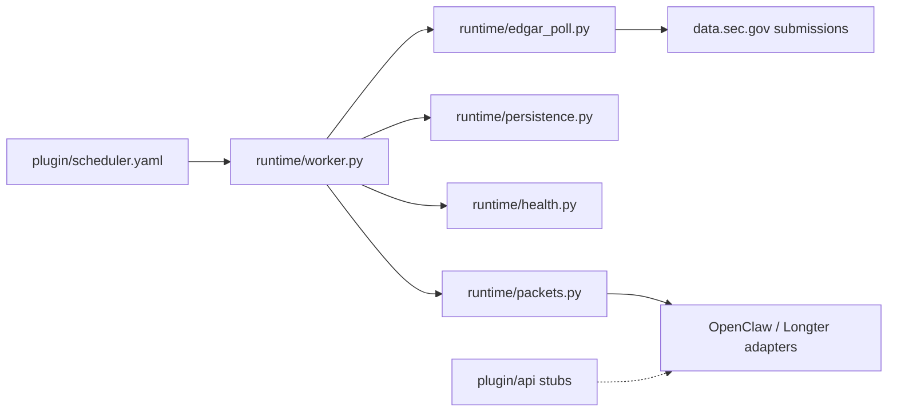

# SPACX V0 runtime

**English** · [中文](#中文)

## Scope (V0)

The `runtime/` package prepares **24/7 read-only consumption** for Longter / OpenClaw autonomous agents. It is **not** a production trading or order-routing layer.

| In scope | Out of scope (V0) |
|----------|-------------------|
| Scheduler tier polling (`plugin/scheduler.yaml`) | Live market data feeds |
| SEC EDGAR poll (CIK 0001181412; 424B4, 10-Q) | Auto execution, wallets, swaps |
| SQLite / JSONL evidence & audit trail | Full REST server (stubs remain in `plugin/api/`) |
| Readiness gates (`health.readiness`) | Bayesian / model training loops |
| Agent packets (thesis, risk, NAP) | External distribution past compliance level 2 |

Compliance floor: **level 2** — research, alerts, action proposals; human gates unchanged. See [COMPLIANCE.md](./COMPLIANCE.md).

## Architecture



## Blockers (wired)

Runtime updates flags from `plugin/metrics/baselines.json` and the EDGAR recent filing list:

| Flag | Meaning | Clears when |
|------|---------|-------------|
| `FINAL_PROSPECTUS_PENDING` | No final 424B4 pricing prospectus | Form **424B4** in EDGAR feed |
| `LOCKUP_DAY0_UNKNOWN` | Prospectus / Day 0 anchor TBD | 424B4 filed (human `day0_anchor_confirmation` still required for charts) |
| `FIRST_EARNINGS_PENDING` | No post-IPO 10-Q yet | Form **10-Q** in EDGAR feed |

While blockers are active, default **NAP** = `OBSERVE_ONLY`, priority **P0** if 424B4 pending.

## Integration with eight agents

| Agent | Runtime touchpoint |
|-------|-------------------|
| **SECFilingAgent** | `edgar_poll` → `filing.detected` / `filing.p0_424b4` / `filing.424b4_pending` |
| **EvidenceAuditorAgent** | Audit receipts; future thesis packets |
| **StarlinkAnalystAgent** | `market_15m` tier stub |
| **AIComputeAnalystAgent** | `market_15m` tier stub |
| **StarshipMilestoneAgent** | `space_4h` tier stub |
| **LockupFloatAgent** | `float_daily` tier stub; blockers include lock-up |
| **MacroLiquidityAgent** | `market_15m` tier stub |
| **OnchainRWAAgent** | `crypto_1_5m` tier stub; evidence seal persistence |

Orchestration detail: [AGENTS.md](./AGENTS.md). Tool mapping: [runtime/openclaw_adapter.md](../runtime/openclaw_adapter.md).

## How to run

```bash
cd spacx
export SPACX_SEC_USER_AGENT="YourOrg SPACX-Research (contact: you@example.com)"
python -m runtime.worker --once
python -m runtime.health --refresh-edgar
```

Persistent state: `runtime/data/` (gitignored).

## Readiness contract

`readiness()` returns:

- `sec_cache_ok` — EDGAR state or successful poll
- `blocker_flags` — three Phase 2 blockers
- `last_edgar_check` — ISO timestamp
- `schema_contract_ok` — required schemas under `plugin/schemas/`
- `ready` — observation worker may run (not “safe to trade”)

---

## 中文

### V0 范围

`runtime/` 为 **Longter / OpenClaw** 等自主代理提供 **只读、7×24** 消费层，用于研究与告警，**不是** 生产交易或下单系统。

| 包含 | 不包含 |
|------|--------|
| 按 `plugin/scheduler.yaml` 轮询调度层级 | 实时行情全量接入 |
| EDGAR 轮询（CIK 0001181412；424B4、10-Q） | 自动成交、链上交易 |
| SQLite / JSONL 证据与审计落库 | 完整 REST 服务（API 仍为 stub） |
| 就绪检查 `readiness()` | 模型训练闭环 |
| 结构化报文（thesis / risk / NAP） | 绕过合规等级 2 对外发布 |

合规底线：**等级 2** — 仅研究、告警、行动建议；人工门控不变。

### 阻断旗标

与 `plugin/metrics/baselines.json` 及 EDGAR 最新申报列表联动：

| 旗标 | 含义 | 解除条件 |
|------|------|----------|
| `FINAL_PROSPECTUS_PENDING` | 最终 424B4 未出现 | EDGAR 出现 **424B4** |
| `LOCKUP_DAY0_UNKNOWN` | 招股书锚定日未定 | 出现 424B4（流通图仍需人工 `day0_anchor_confirmation`） |
| `FIRST_EARNINGS_PENDING` | 首份 10-Q 未出现 | EDGAR 出现 **10-Q** |

阻断未清时，默认 **NAP** 为 `OBSERVE_ONLY`；424B4 待定时为 **P0**。

### 与八个代理的集成

| 代理 | 运行时触点 |
|------|------------|
| **SECFilingAgent** | `edgar_poll` 事件流 |
| **EvidenceAuditorAgent** | 审计回执、日后 thesis 报文 |
| **Starlink / AICompute / Macro** | `market_15m` stub |
| **StarshipMilestoneAgent** | `space_4h` stub |
| **LockupFloatAgent** | `float_daily` stub + 锁定期旗标 |
| **OnchainRWAAgent** | `crypto_1_5m` stub + 证据封存 |

### 运行方式

```bash
cd spacx
export SPACX_SEC_USER_AGENT="贵司 SPACX-Research (联系邮箱)"
python -m runtime.worker --once
python -m runtime.health --refresh-edgar
```

数据目录：`runtime/data/`（不提交 Git）。
